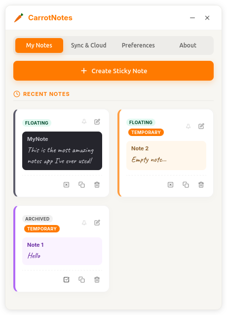
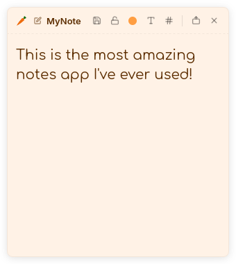
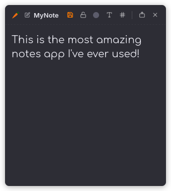
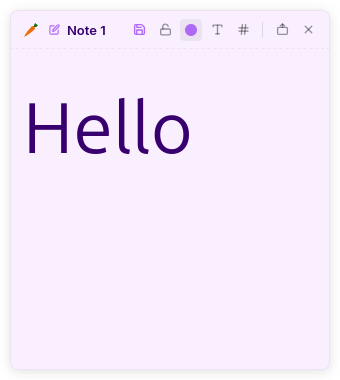
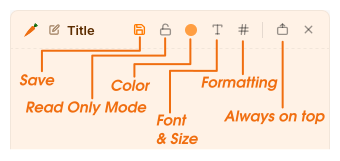
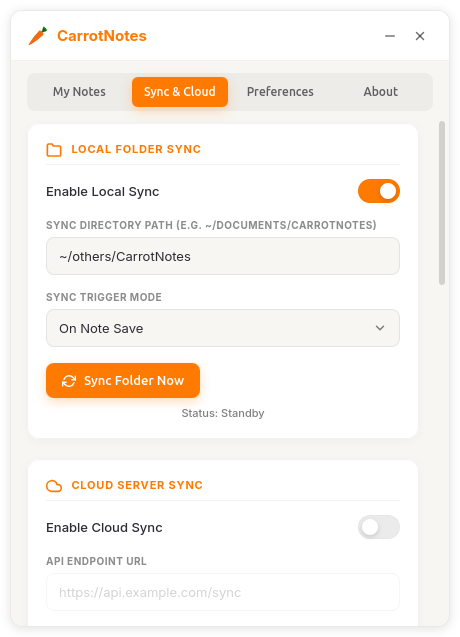
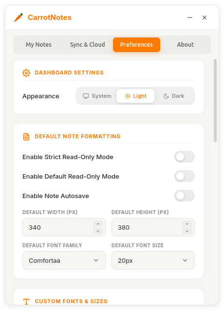

<p align="center">
  <picture>
    <source media="(prefers-color-scheme: dark)" srcset="docs/svg/carrot-app-icon/carrot-app-icon-dark.svg">
    
  </picture>
</p>

<h1 align="center">Carrot Notes</h1>

<p align="center">
  <strong>Lightweight floating sticky notes for Linux.</strong><br>
  Rich editing · Markdown on disk · Sync on your terms
</p>

<p align="center">
  <a href="https://github.com/shakerbr/carrot-notes/releases"></a>
  <a href="LICENSE"></a>
  <a href="#platform-support"></a>
  <a href="https://tauri.app/"></a>
</p>

<p align="center">
  <a href="https://carrot-notes.spidrahub.com"><strong>Website</strong></a>
  ·
  <a href="https://github.com/shakerbr/carrot-notes/releases"><strong>Download</strong></a>
  ·
  <a href="#install"><strong>Install</strong></a>
  ·
  <a href="#screenshots"><strong>Screenshots</strong></a>
  ·
  <a href="CHANGELOG.md"><strong>Changelog</strong></a>
  ·
  <a href="CONTRIBUTING.md"><strong>Contributing</strong></a>
</p>

---

## Overview

Carrot Notes is a **local-first desktop sticky-notes app** built with [Tauri](https://tauri.app/) and Rust. Each note lives in its own floating window — resize it, pin it, keep it always on top — while you write in a clean, Notion-style editor. Under the hood, content is stored as **Markdown**, so your notes stay portable and under your control.

No account required. No vendor lock-in. Optional sync to a folder or your own server.

---

## Screenshots

### Dashboard

Manage all your notes from one place — create, float, archive, pin, and preview at a glance.

<p align="center">
  <picture>
    <source media="(prefers-color-scheme: dark)" srcset="docs/screenshots/dashboard-my-notes-dark.png">
    
  </picture>
</p>

### Floating notes

Each note is its own window. Pick a theme, resize, and keep it on your desktop.

<p align="center">
  
  &nbsp;
  
  &nbsp;
  
</p>

### Note toolbar

Save, lock, color, font, formatting, and always-on-top — everything in reach.

<p align="center">
  
</p>

### Sync & Cloud

Local folder sync, self-hosted cloud, restore from backup, and a danger zone for cleanup.

<p align="center">
  <picture>
    <source media="(prefers-color-scheme: dark)" srcset="docs/screenshots/dashboard-sync-cloud-dark.png">
    
  </picture>
</p>

### Preferences

Appearance, autosave, default formatting, custom fonts, and note colors.

<p align="center">
  <picture>
    <source media="(prefers-color-scheme: dark)" srcset="docs/screenshots/dashboard-preferences-dark.png">
    
  </picture>
</p>

---

## Features

<table>
<tr>
<td width="50%" valign="top">

### Notes & editor

- Independent floating note windows
- WYSIWYG editing — bold, italic, underline, strikethrough
- Bullets, numbered lists, and interactive checklists
- Keyboard shortcuts (`Ctrl+B/I/U`, `Ctrl+Shift+L/O/C`, `Ctrl+S`)
- Per-note colors, fonts, and sizes
- Temporary notes (excluded from sync until named)
- Autosave or manual save with unsaved indicators
- Read-only mode — global, default, or per-note

</td>
<td width="50%" valign="top">

### Dashboard & desktop

- Grid preview of all notes
- Float, archive, pin, rename, duplicate, delete
- System / Light / Dark appearance
- System tray with pinned and recent notes
- Always-on-top per note
- Dock / taskbar entries (Linux)
- Remembers window position and size

</td>
</tr>
<tr>
<td width="50%" valign="top">

### Sync & backup

- **Local folder** — JSON backup + individual `.md` files
- **Cloud** — POST to your own endpoint (Bearer token)
- Manual, on-save, or scheduled sync
- Deleted notes archived to `deleted/` on sync
- Restore from sync — recover deleted or overwritten notes
- Danger zone with typed confirmation

</td>
<td width="50%" valign="top">

### Data & privacy

- Notes stored locally on your machine
- Markdown export via sync folder
- No telemetry or bundled cloud service
- Self-hosted sync when you want it
- Temporary notes never leave your device until named

</td>
</tr>
</table>

---

## Platform support

| Platform | Status | Packages |
|----------|--------|----------|
| **Linux** | Primary — tested on Ubuntu / GNOME (Wayland) | `.deb`, AppImage, `.rpm` |
| **Windows** | May build via Tauri | Not officially tested |
| **macOS** | May build via Tauri | Not officially tested |

> Carrot Notes is **Linux-first**. Windows and macOS builds may work but have not been validated in this release.

---

## Install

Download the latest release from [**GitHub Releases**](https://github.com/shakerbr/carrot-notes/releases).

### Debian / Ubuntu (`.deb`)

```bash
sudo apt install ./carrotnotes_0.1.0_amd64.deb
```

### AppImage (portable)

```bash
chmod +x carrotnotes_0.1.0_amd64.AppImage
./carrotnotes_0.1.0_amd64.AppImage
```

---

## Build from source

**Requirements:** Node.js 18+, Rust 1.77+, and [Tauri prerequisites](https://tauri.app/start/prerequisites/) for Linux.

```bash
git clone https://github.com/shakerbr/carrot-notes.git
cd carrot-notes
npm install
npm run build
```

Built packages are output to `src-tauri/target/release/bundle/`.

### Development

```bash
npm run dev
```

On GNOME + Wayland, dev and production builds use XWayland so **always-on-top works without a shell extension**.

---

## Configuration

| Data | Default location |
|------|------------------|
| Notes | `~/.local/share/com.shakerbr.carrotnotes/notes.json` |
| Settings | `~/.local/share/com.shakerbr.carrotnotes/settings.json` |
| Sync folder | User-defined (contains `.md` files + `carrotnotes_backup.json`) |

### Environment variables

| Variable | Effect |
|----------|--------|
| `CARROTNOTES_NATIVE_WAYLAND=1` | Use native Wayland instead of XWayland. Always-on-top may require [optional GNOME extension](extras/gnome-shell-extension/README.md). |

---

## Known limitations

- Best tested on **GNOME**; other Linux desktops may differ
- **Cloud sync** requires your own server — no official Carrot cloud
- **Desktop only** — no mobile or web client in v0.1.0
- Early release — [issues and feedback](https://github.com/shakerbr/carrot-notes/issues) welcome

---

## Tech stack

| Layer | Technology |
|-------|------------|
| UI | HTML, CSS, JavaScript |
| Editor | [Tiptap](https://tiptap.dev/) (WYSIWYG + Markdown) |
| Runtime | [Tauri 2](https://tauri.app/) |
| Backend | Rust |
| Fonts | [Inter](https://fonts.google.com/specimen/Inter), [Caveat](https://fonts.google.com/specimen/Caveat) |

---

## Brand assets

Marketing and brand files live in [`docs/`](docs/):

| Asset | Path |
|-------|------|
| Screenshots | `docs/screenshots/` |
| App icon (light background) | `docs/svg/carrot-app-icon/carrot-app-icon-light-bg-effect.svg` |
| App icon (dark background) | `docs/svg/carrot-app-icon/carrot-app-icon-dark-bg-effect.svg` |
| Carrot mark (color) | `docs/svg/carrots/carrot-color.svg` |
| Carrot mark (mono) | `docs/svg/carrots/carrot-white.svg`, `docs/svg/carrots/carrot-black.svg` |

---

## Contributing

Contributions are welcome — bug reports, feature ideas, and pull requests.

See [**CONTRIBUTING.md**](CONTRIBUTING.md) for development setup and guidelines.

---

## License

[MIT](LICENSE) © [Shaker Br](https://github.com/shakerbr)

<p align="center">
  
</p>
